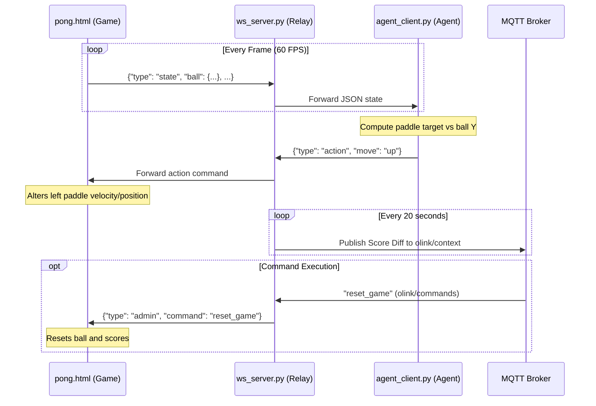

# Pong Demo Game - OmniLink Architecture

This project is a complete demonstration of a multiplayer-capable, agent-driven Pong game. It showcases how a simple browser-based game can be integrated with various communication protocols (WebSockets, MQTT, HTTP) to allow external AI "agents" to perceive game state and control gameplay. 

The primary purpose of this project is to serve as a testbed and integration example for the **OmniLink** architecture, bridging browser logic with Python backend services, MQTT message brokers, and REST APIs.

## How to Run the Project

To start the full environment, you need to launch the MQTT broker, the WebSocket relay server, the game client, and optionally an agent or bridge.

1. **Start the MQTT Broker** (Requires Mosquitto):
   Ensure `mosquitto` is installed and run it with the provided configuration file (which enables WebSockets on port `9001`):
   ```bash
   mosquitto -c mosquitto.conf
   ```

2. **Start the WebSocket Relay Server**:
   In a new terminal window, start the core relay server:
   ```bash
   python ws_server.py
   ```

3. **Open the Game Client**:
   Simply open `pong.html` in your web browser. You should see the game running, with the right paddle moving automatically (built-in AI) and the left paddle waiting for agent commands.

4. **Start an Agent** (Choose one):
   - **Python Agent**: Run the standalone Python client in a new terminal:
     ```bash
     python agent_client.py
     ```
   - **Browser Agent**: Open `agent_runner.html` in your browser to run the TypeScript-based agent (`agent_tool.ts`).

5. **(Optional) Run Additional Middleware**:
   - Start the HTTP Proxy for RESTful agent integration:
     ```bash
     python http_proxy.py
     ```
   - Start the OmniLink MQTT Bridge to sync game state to MQTT:
     ```bash
     python omnilink_bridge.py
     ```

---

## Architecture

The system is composed of several specialized components that work together asynchronously.

```mermaid
graph TD
    Game[Game Client<br/>pong.html] <-->|WS :6789/game| Relay[WebSocket Relay<br/>ws_server.py]
    Relay <-->|WS :6789/agent| AgentPy[Python Agent<br/>agent_client.py]
    Relay <-->|WS :6789/agent| AgentTS[Browser Agent<br/>agent_tool.ts]
    Relay <-->|WS :6789/agent| HttpProxy[HTTP Proxy<br/>http_proxy.py]
    Relay <-->|WS :6789/agent| Bridge[MQTT Bridge<br/>omnilink_bridge.py]
    
    HttpProxy <-.->|HTTP POST/GET| RestAgent[REST API Agent]
    
    Relay -->|Publish Context| MQTTBroker[MQTT Broker<br/>:9001]
    Relay <--|Subscribe Commands| MQTTBroker
    
    Bridge <-->|Publish/Subscribe| MQTTBroker
```

1. **Game Client (`pong.html`)**: 
   - A vanilla HTML5/JavaScript game that handles all physics computation, rendering (using Canvas API), and built-in AI for the right paddle.
   - Connects to the WebSocket Relay as a "game" client at `/game`.
   - Sends continuous telemetry (`state`) and listens for `action` or `admin` commands.

2. **WebSocket Relay Server (`ws_server.py`)**:
   - The central messaging hub of the application running on Python's `asyncio` and `websockets`.
   - Routes messages between the Game Client (at `/game`) and one or more Agent Clients (at `/agent`).
   - Parses the game state to extract and track scores.
   - Connects to the MQTT broker to publish the score difference (`olink/context`) unconditionally every 20 seconds, and subscribes to command topics (`olink/commands`) to forward admin commands (e.g., reset, pause).

3. **OmniLink MQTT Bridge (`omnilink_bridge.py`)**:
   - An asynchronous middleware that subscribes to the WebSocket Relay as a standard agent and simultaneously connects to the MQTT broker.
   - Relays the complete raw game state to MQTT (`olink/context`) every 10 seconds.
   - Listens to MQTT commands on `olink/commands` and pushes them down to the game via the WebSocket Relay.
   - Exposes a feedback mechanism via the `olink/feedback` MQTT topic.

4. **HTTP Proxy API (`http_proxy.py`)**:
   - Acts as an HTTP wrapper around the WebSocket stream for agents that require a RESTful integration.
   - Connects to the WebSocket relay and stores the latest state.
   - Exposes `GET /data` to retrieve the current game state.
   - Exposes `POST /callback` to receive paddle commands and forwards them back into the WebSocket relay.

5. **Agent Implementations**:
   - **`agent_client.py`**: A standalone Python agent using WebSockets to parse state and send up/down actions based on basic heuristics.
   - **`agent_tool.ts` & `agent_tool_easy.ts`**: TypeScript/browser-based agents that operate inside the OmniLink UI or a browser runner (`agent_runner.html`), connecting directly to the WS relay without a backend component.

---

## Exact Data Flow

Below is a sequence diagram visualizing a typical loop of state publishing, agent decision making, and action execution.



1. **State Publishing**:
   - Every frame (approx 60fps), `pong.html` computes physics and constructs a JSON object: `{"type": "state", "ball": {...}, "leftPaddleY": ..., "rightPaddleY": ..., "score": {...}}`.
   - This state is sent to `ws_server.py` over WebSockets (`ws://localhost:6789/game`).

2. **State Relaying & Extraction**:
   - `ws_server.py` receives the state, extracts the scores for internal tracking, and instantly relays the unaltered JSON state to all connected Agent sockets (`/agent`).
   - Concurrently, `http_proxy.py` (if running) intercepts the state via WS and caches it in memory.
   - `omnilink_bridge.py` also intercepts the state and periodically publishes it over MQTT.

3. **Agent Action Generation**:
   - An agent reads the state, computes the paddle target vs. ball Y-coordinate, and issues an action JSON: `{"type": "action", "move": "up" | "down" | "stop"}`.
   - The action is sent back to `ws_server.py` on the `/agent` path.

4. **Action Execution**:
   - `ws_server.py` routes the payload from the agent directly to the `pong.html` game client.
   - The game client receives the action and instantly alters the left paddle's Y velocity/position.

5. **Command Execution (MQTT)**:
   - A command (e.g., `"pause_game"`) is sent to the `olink/commands` MQTT topic.
   - `ws_server.py` and `omnilink_bridge.py` both listen to this topic. `omnilink_bridge.py` catches the payload in a synchronous background thread and safely ports it to the async WebSocket loop using `asyncio.run_coroutine_threadsafe()`.
   - The command is formatted as `{"type": "admin", "command": "pause_game"}` and dispatched over WebSockets to `pong.html`.
   - The game client receives the action. It halts the physics rendering loop seamlessly and displays an overlay on the HTML Canvas indicating the paused state.

---

## Protocol Endpoints

### 1. WebSocket Relay Server (`ws://localhost:6789`)
- **`ws://localhost:6789/game`**: Used exclusively by the `pong.html` app. Publishes game states and consumes actions.
- **`ws://localhost:6789/agent`**: Used by agents, the HTTP proxy, and the Bridge. Consumes game states and publishes actions.

### 2. HTTP Proxy Server (`http://localhost:5000`)
- **`GET /data`**: Returns the absolute fastest, latest cached game state structure.
- **`POST /callback`**: Expects a JSON payload containing an `action` block to execute movements (e.g. `{"action": "UP"}`).

### 3. MQTT Broker (`ws://localhost:9001`)
*(Note: Requires Eclipse Mosquitto or similar running on WebSockets transport)*
- **`olink/context`**: Published by `ws_server.py` (score diff every 20s) and `omnilink_bridge.py` (full JSON state every 10s).
- **`olink/commands`**: Subscribed by `ws_server.py` and `omnilink_bridge.py`. Accepts text commands such as `reset_game`, `reset_score`, `pause_game`, `resume_game`.
- **`olink/feedback`**: Routine heartbeat or agent diagnostic feedback channel published by `omnilink_bridge.py`.

---

## Frameworks & Technologies

### Languages
- **Python 3**: Core backend execution language for relaying, proxies, and bridges. heavily leveraging asynchronous concurrency (`asyncio`).
- **JavaScript (Vanilla JS)**: HTML5 Canvas rendering and game loop.
- **TypeScript**: Typed structures for the client-side browser agents (`agent_tool.ts`).

### Libraries & Dependencies
- **`websockets` (Python)**: High-performance async WebSocket library acting as the nervous system.
- **`paho-mqtt` (Python)**: MQTT client library configured specifically for WebSocket transport (`transport="websockets"`).
- **`http.server` (Python Standard Library)**: Lightweight, threaded basic HTTP routing in `http_proxy.py`.
- **`asyncio` (Python Standard Library)**: Primary execution engine driving the non-blocking I/O of all backend processes.

### Infrastructure (Required)
- **MQTT Broker**: Typically handled by Mosquitto (`mosquitto.conf`) with `listeners` exposed on port 9001 enabling the ws protocol.
